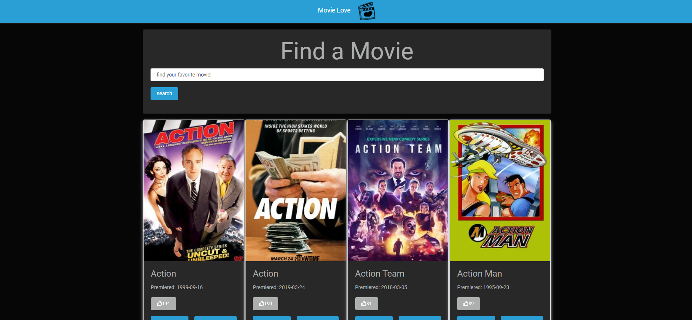

# Capstone API

> In this Capstone i have chosen a Movie app for [Microverse](https://microverse.io) platform.

## Built With

- HTML
- CSS
- Javascript
- Webpack-cli

## Getting Started

To get a local copy up and running follow these simple example steps.

### Prerequisites
  
- Node.js

### Setup

- Use your github account and your terminal to clone this repository to your computer:

`https://github.com/General-Bradley9608/Search-Movie-API-JS.git`

- Go to the cloned directory:
`cd Search-Movie-API-JS`

- Run the following command to install dependencies:
`npm install`

- Run the command to run the build:
`npm run build`

- Run the following command to compile the files for production:
`npx webpack serve`

### Usage

Run dist/index.html in your preferred browser.

<!-- ### Run tests

- On the terminal `cd` to the folder you just cloned.
- On the terminal type `rspec`. -->

## Authors

- GitHub: [My Github](https://github.com/General-Bradley9608)

## 🤝 Contributing

Contributions, issues, and feature requests are welcome!

## Show your support

Give a ⭐️ if you like this project!

## Acknowledgments

## 📝 License

This project is [MIT](./MIT.md) licensed.
